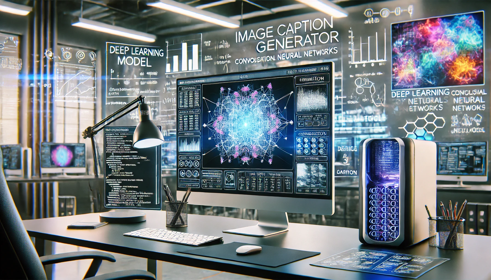
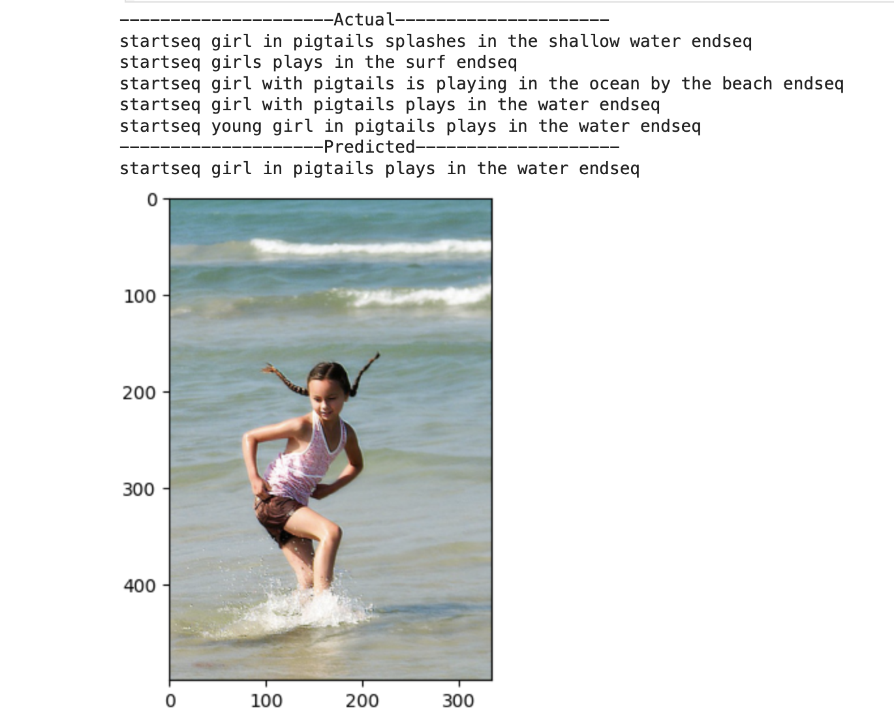

# Image Caption Generator Using Deep Learning And Convolutional Neural Networks

## Project Overview

The Image Caption Generator project employs deep learning models to automatically generate captions for images. This involves understanding both the visual content of images and the linguistic patterns of language. Two distinct architectures have been explored:

### CNN + LSTM Architecture:
This model uses Convolutional Neural Networks (CNN) to extract visual features from the images, followed by Long Short-Term Memory (LSTM) networks to generate the corresponding text captions.

### ResNet + GRU Architecture:
This model upgrades the visual feature extraction by employing a more robust and deeper ResNet architecture, while the caption generation is handled by Gated Recurrent Units (GRU), known for their efficiency in sequence generation.

## Data Description
The project uses a standard image-captioning Flickr dataset, which typically consists of:

**Images**: A collection of diverse photographs requiring contextual understanding for caption generation.

**Captions**: Multiple descriptive captions per image, providing a range of linguistic expressions corresponding to the visual content.

## Methodology
The methodology section covers the end-to-end process of building the Image Caption Generator, including:

### Data Preprocessing: 
Images are preprocessed to normalize their sizes and pixel values, while captions are tokenized and encoded into numerical sequences. Padding is applied to ensure consistent sequence lengths.

### Feature Extraction:
**CNN/ResNet**: Used to convert images into a compact representation of visual features.

**LSTM/GRU**: These sequence models take the visual features and previously generated text as inputs to predict the next word in the sequence.

## CNN + LSTM Model

### Model Building:

**Feature Extraction (CNN)**: This stage uses a Convolutional Neural Network (CNN) to transform input images into a set of feature vectors. Typically, a pre-trained model like VGG16 or InceptionV3, with their top layers removed, is employed to leverage learned visual patterns from large datasets without the classification layers. The output is a compact representation of the image's visual information.

**Sequence Processor (LSTM)**: The Long Short-Term Memory (LSTM) network is designed to handle the sequence prediction part of the model. It takes the image features from the CNN as the initial state to understand the context of the image. Then, it processes sequences of words (previous parts of the caption) to predict the next word in the caption. This setup involves embedding the textual input to a dense vector, which is then processed by the LSTM cells to generate a sequence of predictions.

### Model Evaluation:

**Loss Function**: The model typically uses categorical cross-entropy as a loss function, which quantifies the difference between the predicted word distributions and the actual words in the training data.

**Performance Metrics**: Evaluation is primarily done using BLEU (Bilingual Evaluation Understudy) scores, which measure how close the machine-generated captions are to a set of reference captions. BLEU considers precision of word matches, adjusted for sentence length.

**Validation**: The model is validated on a separate set of images and captions that were not seen during the training phase. This helps in assessing how well the model can generalize to new data.

## Model Result:

## ResNet + GRU Model

### Model Building: 

**Feature Extraction (ResNet)**: The ResNet model, known for its deep architecture with residual connections, is used for more effective feature extraction from images. It addresses the vanishing gradient problem, allowing for training substantially deeper networks than traditional CNNs. The features extracted are more detailed and potentially capture more complex visual patterns.

**Sequence Processor (GRU)**: The Gated Recurrent Unit (GRU) is similar to an LSTM but with a simplified structure, which reduces the computational burden while maintaining similar performance. GRUs manage the flow of information without separate memory cells, using update and reset gates to modulate the information between past (previous words/captions) and future (next word prediction).

### Model Evaluation:

**Loss Function**: Just like the CNN+LSTM model, the ResNet+GRU employs categorical cross-entropy to quantify how well the predicted probability distribution aligns with the actual distribution of the words in the captions.

**Performance Metrics**: Apart from BLEU scores, this model's evaluation might also include METEOR (Metric for Evaluation of Translation with Explicit ORdering) scores, which consider synonyms and stemmed versions of words, providing a more nuanced assessment of the generated captions' quality.

**Validation**: The validation for this model also involves testing on unseen images and captions. Additionally, the robustness and depth of ResNet might be particularly validated under conditions of varied image complexity and diverse datasets.

## Model Result:

## Conclusion

The Image Caption Generator project highlights the capabilities of advanced neural architectures in bridging visual content with natural language. The CNN + LSTM model provides a robust baseline, while the ResNet + GRU model introduces enhanced depth and efficiency, potentially offering improvements in both accuracy and speed of caption generation.

